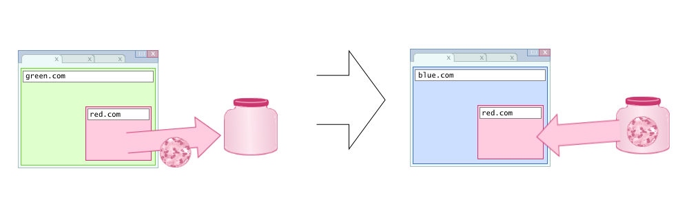
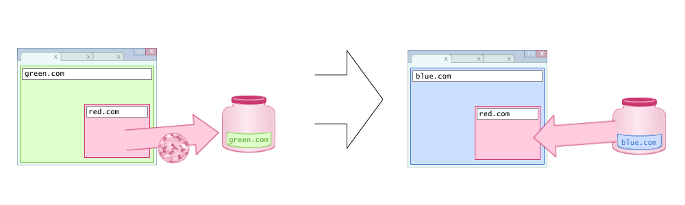

# CHIPS (Cookies Having Independent Partitioned State)

## Editors

- [Dylan Cutler](https://github.com/DCtheTall)
- [Kaustubha Govind](https://github.com/krgovind)

## Participate

- https://github.com/DCtheTall/CHIPS/issues

## Table of Contents

- [Motivation](#motivation)
- [Key Scenarios](#key-scenarios)
    - [Third-party store-finder service](#third-party-store-finder-service)
    - [CDN load balancing](#cdn-load-balancing)
    - [Headless CMS](#headless-cms)
    - [Other examples of use cases](#other-examples-of-use-cases)
- [Non-goals](#non-goals)
- [CHIPS: Opt-in Partitioned Cookies](#chips-opt-in-partitioned-cookies)
- [Design Principles](#design-principles)
    - [Opt-in partitioned cookies](#opt-in-partitioned-cookies)
    - [Only sent over secure protocols](#only-sent-over-secure-protocols)
    - [Hostname-bound](#hostname-bound)
    - [Only visible to the HTTP layer](#only-visible-to-the-http-layer)
- [Detailed Design](#detailed-design)
    - [Opt-in cookie attribute](#opt-in-cookie-attribute)
    - [Partition by top-level context](#partition-by-top-level-context)
    - [Using `Set-Cookie` with `Partitioned`](#using-set-cookie-with-partitioned)
    - [Example usage](#example-usage)
        - [Using Partitioned for third-party embeds](#using-partitioned-for-third-party-embeds)
        - [CDN load balancing and headless CMS](#cdn-load-balancing-and-headless-cms)
    - [How to enforce design principles](#how-to-enforce-design-principles)
        - [Partitioned cookies must use the `__Host-` prefix](#partitioned-cookies-must-use-the-__host--prefix)
        - [`HttpOnly` attribute](#httponly-attribute)
        - [`SameSite` attribute](#samesite-attribute)
        - [`SameParty` attribute](#sameparty-attribute)
        - [Limit the number of cookies a third party can use in a single partiton](#limit-the-number-of-cookies-a-third-party-can-use-in-a-single-partition)
    - [Clearing partitioned cookies](#clearing-partitioned-cookies)
    - [Handling older or incompatible clients](#handling-older-or-incompatible-clients)
    - [Service workers](#service-workers)
- [Alternative Solutions](#alternative-solutions)
    - [Partition all third-party cookies by default](#partition-all-third-party-cookies-by-default)
    - [Limit the number of cookies in a top-level context's partition](#limit-the-number-of-cookies-in-a-top-level-contexts-partition)
    - [Applying the 180 cookies-per-domain limit](#applying-the-180-cookies-per-domain-limit)
    - [Requiring the `__Secure-` prefix](#requiring-the-__secure--prefix)
    - [Not requiring the `__Host-` prefix](#not-requiring-the-__host--prefix)
    - [DNS CNAME’ing](#dns-cnameing)
- [Prior Art](#prior-art)
- [References and Acknowledgements](#references-and-acknowledgements)
    - [Acknowledgements](#acknowledgements)
    - [References](#references)

## Motivation

In order to increase privacy on the web, browser vendors are either planning or already shipping restrictions on cross-site tracking.
This includes [phasing out support for _third-party cookies_](https://blog.chromium.org/2020/01/building-more-private-web-path-towards.html), cookies sent in requests to sites other than the top-level document's site, since such cookies enable servers to track users' behavior across different top-level sites.

<center><figure>
    
    <br>
    <em>
        Before CHIPS: A browser visits green.com which has an embedded red.com frame that sets a cookie. When the browser navigates to blue.com, the red.com frame can access the cookie set at green.com.
    </em>
    <br><br>
</figure></center>

Although third-party cookies have the unfortunate consequence of enabling sites to track user behavior across different top-level sites, there are also use cases on the web today where cross-domain subresources require some notion of session or persistent state.
Some examples of such use cases are [SaaS providers](https://github.com/privacycg/first-party-sets/issues/33), [headless CMS providers](https://gist.github.com/rexxars/42d870946d82a3daa0e35b238e0b7d7a), and sandbox domains for serving untrusted user content, e.g. `googleusercontent.com`, `githubusercontent.com` ([1](https://blog.kerika.com/googleusercontent-com-can-trip-you-up-if-you-disable-third-party-cookies/), [2](https://gadgetstouse.com/blog/2020/12/11/fix-google-drive-downloads-not-working-in-microsoft-edge/)).
In these scenarios, the intention for the cookies is not to track across sites, but to provide a notion of session (or state) to embedders for a user's activity within a single top-level context.

## Key Scenarios

Below are some examples of third-party cookie use cases that are unrelated to tracking that we would like to support with CHIPS. We first describe how unpartitioned third-party cookies meet that particular use case and then we describe the ideal end state would be when cross-site cookies are partitioned by top-level site.

### Third-party store-finder service

#### Before unpartitioned third-party cookies are blocked

Let's say that a page on `shoes.com` wants to show users a map of their store locations, but they do not have the  resources to implement a locator service.
Instead, they contract that work out to a third-party SaaS provider.
`embed.maps.com`, and `shoes.com` embeds a frame owned by `embed.maps.com` which renders a map that users can use to pick their preferred store location and look up directions.

When the browser is on `shoes.com`, an embedded frame owned by `embed.maps.com` sets a cookie to store a user's preferred store location:

```
Set-Cookie: __Host-locationid=187; SameSite=None; Secure; HttpOnly; Path=/;
```

On subsequent visits to `shoes.com`, the first request to `embed.maps.com` would include the following header:

```
Cookie: __Host-locationid=187;
```

This allows `embed.maps.com` to know the user's preferred location for `shoes.com`, which can be used for server-side rendering of their map, resulting in end users seeing a faster-loading map which remembers their preferred store location. However, this unpartitioned cookie could also include cross-site identifiers that let `embed.maps.com` track user activity across top-level sites.

#### After unpartitioned third-party cookies are blocked

Without the ability to set any cross-site cookies, one alternative that services like `embed.maps.com` have is to use other forms of browser storage (e.g. LocalStorage).
In order to detect the presence of these other types of client state, `embed.maps.com` will have to wait for a JavaScript execution context to load before they can access the user preferences: resulting in longer loading times and a worse user experience.

Our goal is for sites like `embed.maps.com` to be able to set a cookie while embedded into `shoes.com` that would only be sent when the user's browser's top-level site is `shoes.com`.
If the user navigates to another top-level site, subsequent requests to `embed.maps.com` would not include the cookie set when the top-level site was `shoes.com`.
This would enable `embed.maps.com` to store user preferences with cookies without being able to store a cross-site identifier on users' machines.

### CDN load balancing

#### Before unpartitioned third-party cookies are blocked

Consider the site `example.com` who uses a third-party CDN, `static.cdn.com` to host some of its static assets.
`static.cdn.com`'s network uses load balancing servers which use a cookie to store the result of computing the best way to route an incoming request.

With unpartitioned third-party cookies, when a user navigates to `example.com` for the first time, `static.cdn.com` would respond to a browser's first request with the following `Set-Cookie` header:

```
Set-Cookie: __Host-lb=a3e7; SameSite=None; Secure; HttpOnly; Path=/;
```

...where the value of the cookie is some string of bits that `static.cdn.com`'s load balancers can use to direct a request.
Subsequent requests to `static.cdn.com` would include the following `Cookie` header:

```
Cookie: __Host-lb=a3e7;
```

The ability to set a cookie this way allows requests to `static.cdn.com` to have lower latency, since they do not need to compute how to route each request to the server.
This improved latency provides a better experience for users on sites that use `static.cdn.com` to serve static content.

The problem with this design is that when a user navigates to another top-level site that also uses `static.cdn.com` to serve static content, the load balancing cookie will be sent in requests to `static.cdn.com`.
It follows that `static.cdn.com` could also use this cookie to also tie together users' sessions across different top-level sites.

#### After unpartitioned third-party cookies are blocked

Without unpartitioned cookies, `static.cdn.com` could not use cookie to store load balancing information on the client side.
This means that they must either compute the best way to route a request each time a user pings their server, but this would increase latency and lead to user frustration.
`static.cdn.com` could use alternative storage mechanisms to store this information for its load balancers, but this would mean that `static.cdn.com` would need script execution in order to access this information.
This means that if `example.com` is just using `static.cdn.com` to host static assets and does not want to embed their JavaScript into their site, users would experience high latency.

Our goal is to allow third-party CDNs like `static.cdn.com` to be able to use cookies for their load balancers but have those cookies be partitioned by top-level site.
This means that if `static.cdn.com` sets a load balancing cookie on a browser on `example.com`, requests to `static.cdn.com` will not include that cookie when the browser navigates to `other.com`.

This implies that `static.cdn.com` will have to recompute the value of the load balancing cookie for each top-level site a user visits.
However, this is preferable to blocking all cookies in third-party contexts because then `static.cdn.com` will have to compute the best way to route a request each time.
A partitioned cookie is also more preferable for `static.cdn.com` than JavaScript storage since any data in storage would not be available until the document loads.

### Headless CMS

#### Before unpartitioned third-party cookies are blocked

Consider the site `example.com` now wants to use a third-party [headless CMS](https://en.wikipedia.org/wiki/Headless_content_management_system), `headless.cms.com`, to store data which example.com's custom front end code uses to render their page.
In order to tie together requests to `headless.cms.com` to a single session, their server sets a cookie:

```
Set-Cookie: __Host-SID=c78ef; SameSite=None; Secure; HttpOnly; Path=/;
```

Subsequent requests to `headless.cms.com` would include the following `Cookie` header, even when the top-level site is no longer `example.com`:

```
Cookie: __Host-SID=c78ef;
```

#### After unpartitioned third-party cookies are blocked

Our goal is to give sites like `headless.cms.com` a way to set session cookies partitioned by top-level site and are available after unpartitioned third-party cookies are blocked.
These cookies could be used to identify which requests belong to the same session within a top-level site.
However, unlike the current state of the art, we do not want a cookie set when the top-level site is `example.com` to be sent when the browser navigates to another site.

### Other examples of use cases

Some other examples of use cases for partitioned cookies not listed above are:

- Third-party CDNs that use cookies to serve access-controlled content
- Front-end frameworks that rely on remote hosting and RPCs to remote services
- Other types of third-party SaaS embeds

## Non-goals

- This document does not describe any changes to how a top-level site interacts with its own site's cookies.

- This document also does not describe a replacement for third-party cookies that are shared across different domains owned by the same first party.

- If you are using cross-site cookies between first-party domains that may be visited in top-level context, consider using [First-Party Sets](https://github.com/privacycg/first-party-sets).

- This document also does not describe partitioning any other type of browser storage other than cookies (e.g. HTTP cache, LocalStorage, service workers, etc.).

## CHIPS: Opt-in Partitioned Cookies

In order to meet the use cases, we propose to introduce partitioned cookies a.k.a. CHIPS (Cookies Having Independent Partitioned State).

Under this proposal when a user visits `green.com` and embedded content from `red.com` sets a cookie in response to the cross-site request, the user agent would only send that cookie when the top-level site is `green.com`.
When they are visiting a new site, `blue.com`, an embedded `red.com` frame would not receive the cookie set when `red.com` was embedded in `green.com`.

<center><figure>
    
    <br>
    <em>
        After CHIPS: A browser visits green.com which has an embedded red.com frame that sets a cookie. When the user visits blue.com, the red.com frame cannot access the cookie set at green.com since it was a different top-level site.
    </em>
    <br><br>
</figure></center>

**Note:** Firefox recently introduced partitioning all third-party cookies by default as a compatibility measure in the ETP Strict mode, and Safari briefly enabled (and subsequently rolled back) this in a previous version of ITP.
More details on this approach are covered in the section [Partition all third-party cookies by default](#partition-all-third-party-cookies-by-default).

The purpose of this document is to propose a new cookie attribute, `Partitioned`, which will allow user agents to opt-in to partitioning cookies by top-level context, i.e. partitioned by top-level site (or that site's [First-Party Set](https://github.com/privacycg/first-party-sets) if it has one).

## Design Principles

### Opt-in partitioned cookies

The primary aspect that distinguishes this proposal from existing implementations of partitioned cookies is the developer opt-in.
Cookies must be set with a new attribute in order to be sent on cross-party requests once (unpartitioned) third-party cookies are obsoleted.

This principle is in line with the [principle of least privilege](https://en.wikipedia.org/wiki/Principle_of_least_privilege) in the long term.
Initially, this new attribute will restrict a cookie's behavior, since it will limit the scope in which cookies can be sent compared to unpartitioned third-party cookies.
But, in the long term these cookies will be the only cookies available in cross-party contexts.

Although existing software and APIs will need to be updated to support this new cookie attribute, we believe that an opt-in will be the best way to help move the web from (unpartitioned) third-party cookies without causing unexpected bugs.
See the [Partition all third-party cookies by default](#partition-all-third-party-cookies-by-default) section below for more information.

### Only sent over secure protocols

Partitioned cookies must only be set by and sent over secure protocols.
This helps address some aspects of cookies' [weak confidentiality](https://tools.ietf.org/html/draft-ietf-httpbis-rfc6265bis-07#section-8.5) and [weak integrity](https://tools.ietf.org/html/draft-ietf-httpbis-rfc6265bis-07#section-8.6).

### Hostname-bound

Partitioned cookies should also be hostname bound.
This and the requirement partitioned cookies be sent over secure protocols makes partitioned cookies as close to origin-bound as possible.
We also would like have user agents scope partitioned cookies by port as well, making them origin-scoped, but we think this requirement should only be enforced if/when [Origin-Bound Cookies](https://github.com/sbingler/Origin-Bound-Cookies) is enabled.

### Only visible to the HTTP layer

Partitioned cookies should only be visible to the HTTP layer, which makes them less vulnerable to security vulnerabilities such as XSS-attacks.

Since Chrome data suggests only ~17% of cookies use the `HttpOnly` attribute, we believe that requiring partitioned cookies be HTTP-only will help facilitate cookies becoming more secure overall.

Note: This requirement and the requirement to only use secure protocols makes partitioned cookies behave more similarly to [HTTP State Tokens](https://github.com/mikewest/http-state-tokens).

### Avoid a large memory footprint

One concern about introducing partitioned cookies is the proliferation of state on users' machines.
With unpartitioned third-party cookies, a single third party only needed to set one cookie on a user's machines which could be used for cross-site requests across all top-level sites a user visits.
After unpartitioned third-party cookies are removed, a third party will need to set one cookie per top-level context the user visits, resulting in more cookies set on user's machines.

Browsers that wish to support partitioned cookies must impose additional limitations on the number of cookies available to a third-party domain per-partition.

However, it is also necessary for user agents to design these limits in a way that does not allow malicious third parties from learning cross-site information about users.
See [Limit the number of cookies in a top-level context's partition](#limit-the-number-of-cookies-in-a-top-level-contexts-partition) and [Applying the 180 cookies-per-domain limit](#applying-the-180-cookies-per-domain-limit) in [Alternative Solutions](#alternative-solutions) for more details.

## Detailed Design

### Opt-in cookie attribute

We propose a new cookie attribute, `Partitioned`, which must be specified by the `Set-Cookie` header to indicate that the cookie should be stored in a per-top-level partition.
Any cookies that are not set with the `Partitioned` attribute will eventually be blocked in third-party contexts.
(Note: Other features like the [`SameParty`](https://github.com/cfredric/sameparty) attribute may adjust the details of such blocking across domains within the same First-Party Set.)

### Partition by top-level context

Cookies set with the `Partitioned` attribute must only be sent to the third-party host when the user agent is in the same _top-level context_ as when the cookie was first set.

For most sites, the top-level context is just the top-level site. However, when the top-level site is part of a [First-Party Set](https://github.com/privacycg/first-party-sets), the third-party can share the same partition across sites within the same set.
This is consistent with Chrome’s [privacy principle of partitioning identity by first party](https://github.com/michaelkleber/privacy-model#identity-is-partitioned-by-first-party-site), and ensures that tracking across unrelated sites is prevented by the obsoletion of unpartitioned third-party cookies.

### Using `Set-Cookie` with `Partitioned`

Below is an example of a `Set-Cookie` header that uses the `Partitioned` attribute:

<pre>
Set-Cookie: __Host-SID=31d4d96e407aad42; SameSite=None; Secure; HttpOnly; Path=/; <b>Partitioned;</b>
Set-Cookie: abc=21ef; SameSite=None; Secure // blocked in 3p contexts
</pre>

In third-party contexts, the `Partitioned` cookies would be sent in the request header as follows:

```
Cookie: __Host-SID=31d4d96e407aad42
```

Note: If this is a first-time request to the third-party within the current top-level context, no cookies would be sent.
In other words, the third-party would get a new identifier for each top-level context.

### Example usage

Below is a description of how `Partitioned` cookies can be used to meet the use cases laid out in the [Key Scenarios](#key-scenarios) section above.

#### Using Partitioned for third-party embeds

Let us reconsider [example](#third-party-store-finder-service) of `shoes.com` and `embed.maps.com`: a locator service which wishes to use a cookie to store user preferences for their activity on `shoes.com` (e.g. their favorite store location).

After third-party cookies are removed, `embed.maps.com` could no longer set a cookie when the top-level site is not `maps.com` or not in a First-Party Set with `maps.com`, unless they include the `Partitioned` attribute:

<pre>
Set-Cookie: __Host-locationid=187; SameSite=None; Secure; HttpOnly; Path=/; <b>Partitioned;</b>
</pre>

When the browser's top-level context is still `shoes.com`, any subsequent request to `embed.maps.com` would include the following header:

```
Cookie: __Host-locationid=187;
```

However, when the browser navigates to a different top-level context then the browser would not send the `Cookie` header above to `embed.maps.com`.
This gives `embed.maps.com` the capability to store users' favorite `shoes.com` store location, but those preferences would only be accessible to `embed.maps.com` when the top-level context is `shoes.com`.
This is to ensure that `embed.maps.com` cannot use this cookie to link users' activity across different top-level contexts.

#### CDN load balancing and headless CMS

Cookies with the `Partitioned` attribute can meet the load balancing use case for `static.cdn.com` or the session cookie for `headless.cms.com`.
For the sake of brevity, let us only consider the load balancer use case.

When the user visits example.com and static.cdn.com wants to set a cookie storing the result of computing the best way to direct this particular user's requests. They could do so using the Partitioned attribute using the following Set-Cookie header:

<pre>
Set-Cookie: __Host-lb=a3e7; SameSite=None; Secure; HttpOnly; Path=/; <b>Partitioned;</b>
</pre>

This cookie would only be available to `static.cdn.com` when the browser's top-level site is `example.com`.
When the browser navigates to another top-level site, then subsequent requests to `static.cdn.com` will not include this cookie.

One can extend this to the headless CMS example using the `__Host-SID` cookie described in the [Key Scenarios](#key-scenarios) section.

### How to enforce design principles

#### Partitioned cookies must use the `__Host-` prefix

User agents must only accept Partitioned cookies which have the `__Host-` prefix.

The `__Host-` prefix requires that the cookie be set with `Secure` and `Path=/` and disallows the `Domain` attribute.
These requirements ensure that partitioned cookies only be set from and sent to secure origins only.
It also makes the cookies hostname-bound within a partition.
This requirement would have the semantics of partitioned cookies as close to origin-bound as possible.

#### `HttpOnly` attribute

User agents may also enforce that `Partitioned` cookies also include the `HttpOnly` attribute, but we are less confident they should require it.
Ensuring that partitioned cookies are only available on the network stack makes them less susceptible to XSS attacks.

#### `SameSite` attribute

User agents may only accept `Partitioned` cookies if their `SameSite` attribute is `None`.

**Note:** a `Partitioned` cookie without `SameSite=None` is effectively just a same-site cookie which cannot be sent in a third-party context anyway.

#### `SameParty` attribute

User agents should reject any cookie set with both `Partitioned` and `SameParty` attributes.
Since sites within the same First-Party Set are allowed access to unpartitioned `SameParty` cookies, the semantic is inconsistent with partitioned cookies.

#### Limit the number of cookies a third party can use in a single partition

A third-party domain's cookie jar should have a much lower per-partition size limit than existing garbage collection thresholds ([180 cookies per domain](https://source.chromium.org/chromium/chromium/src/+/master:net/cookies/cookie_monster.h;l=104;drc=da465ccade3a693e1deac3bf01b1c83d12dbf553) in Chrome).
User agents must limit third-party domains to just one or some small number of cookies per-partition.
Tthe number of cookies in a single partition per third-party is scoped by domain so that a third-party could not circumvent this limit by registering new subdomains.

User agents may enforce some global limit on the number of partitioned cookies in the cookie jar.
This is to ensure that as a user visits more top-level sites over time that the number of partitioned cookies saved to their machine does not grow over time without bound.

### Clearing partitioned cookies

If a top-level site sends `Clear-Site-Data`, then the user agent clears all partitioned cookies available to third-parties from that site as well.

If a third-party site sends `Clear-Site-Data`, then the user agent should clear all cookies available to that third-party in the partition for the current top-level site alone.
The user agent must not clear the third-party's cookies in other partitions.
This is to prevent abuse of such a capability as a cross-site tracking vector as [described here](https://github.com/privacycg/storage-partitioning/issues/11).

Browsers may choose to provide user controls to clear individual partitions of a site’s cookies.

### Handling older or incompatible clients

The new cookie attribute will be ignored on older clients that don't recognize it and fall back to default behavior.
Since these cookies are intended for third-party contexts, [clients that are incompatible with `SameSite=None`](https://www.chromium.org/updates/same-site/incompatible-clients) may reject cookies with `SameSite=None`.

It is also recommended to still include the `__Host-` prefix.
Even clients that do not recognize the `Partitioned` attribute still enforce the semantics of the `__Host-` prefix.
This would ensure that cross-site cookies are hostname bound and only sent over secure channels, which is still a security win.

### Service workers

Service workers have access to cookies via the [CookieStore](https://wicg.github.io/cookie-store/explainer.html) API or when they send HTTP requests using `fetch` (imagine a worker pings an HTTP endpoint that just echoes back the request's `Cookie` header in its response).
Unless service workers are partitioned, then the unpartitioned cookie jar would be available to the worker even if the cookies are `HttpOnly`.
Because of these reasons, partitioning service workers is the only way to guarantee a partitioned cookie jar.

Safari [has already partitioned service workers](https://webkit.org/blog/8090/workers-at-your-service/) by the top-level origin when the worker was registered and the service worker's origin, so that service workers can only interact with windows that are the same top-level origin as the top-level page when the worker was installed.
If a user agent partitions service workers using this scheme, there is no cross-site tracking risk to exposing `Partitioned` cookies to service workers.

[Service workers are disabled](https://developer.mozilla.org/en-US/docs/Mozilla/Firefox/Privacy/State_Partitioning) in Firefox when Dynamic Partitioning is enabled, but they are [working on implementing a partitioned service worker solution](https://bugzilla.mozilla.org/show_bug.cgi?id=1495241).

## Alternative Solutions

### Partition all third-party cookies by default

[Firefox](https://blog.mozilla.org/security/2021/02/23/total-cookie-protection/) announced that they are partitioning all third-party cookies by default into their ETP Strict mode.
Safari [previously](https://webkit.org/blog/8613/intelligent-tracking-prevention-2-1/) tried partitioning cookies based on heuristics, but eventually chose to block them altogether citing developer confusion as one of the reasons.

We do not think cookies should be partitioned without a developer opt-in since developers built their existing servers with the expectation of an unpartitioned third-party cookie.
This can cause confusion and unexpected bugs ([1](https://bugzilla.mozilla.org/show_bug.cgi?id=1316019), [2](https://bugzilla.mozilla.org/show_bug.cgi?id=1319728), [3](https://bugzilla.mozilla.org/show_bug.cgi?id=1629062), [4](https://bugzilla.mozilla.org/show_bug.cgi?id=1651134)).

Partitioning by default also has more implementation complexity for browser developers, since they need to consider how partitioning the cookie jar will impact any part of the browser that interacts with cookies.
Supporting opt-in cookie partitioning while gradually moving the web off of globally-scoped third-party cookies will help ease the transition for browsers.

There is also the issue of state proliferation.
There are some third-party origins on the web today that are prevalent across many top-level contexts.
If we partition the cookie jar by default and do not include a new upper bound on the size of each cookie jar partition, device storage limits will be exhausted more quickly.

### Limit the number of cookies in a top-level context's partition

One additional limitation user agents may also enforce is to limit the number of cookies in a top-level context's partition across all third-party domains as well.
This limit would prevent a single top-level context's partition from taking up too much space in the cookie jar.

We chose not to enforce a global per-partition limit is that it would open a side channel for a third party to learn if another, distinct third party set a cookie within the same top-level context.

For example, say each third-party domain is restricted to 1 cookie per partition and the global per-partition limit was 10.
A malicious third party could embed frames from several domains, `evil[1-10].com` on some top-level site, `1p.com`, which sets a partitioned cookie.
If any other third party sets a partitioned cookie on `1p.com`, then one of the `evil[1-10].com` cookies will be evicted and the malicious third party will learn that another, distinct host set a cookie.
A malicious third party could use this information to determine if a user has logged in or if they may be using a locator service hosted by a distinct party.

Another attack is where `evil.com` communicates with other third parties by setting cookies only based on a user’s personal attributes or preferences.

One way to potentially circumvent this is to make the global per-partition limit much larger than the per-partition limit for each third-party domain, but it is unclear what the relative size of the global per-partition limit would have to be to mitigate these attacks.

### Applying the 180 cookies-per-domain limit

We recommend that user agents do not include `Partitioned` cookies in the 180 per-domain cookie limit.
The reason being that malicious third parties could abuse this information to learn information about users across different top-level partitions.

Say `evil.com` was embedded on a site, `1p.com`, and it sets 180 cookies on the users' machines when they visit `1p.com`.
On other top-level sites, `evil.com` sets another cookie which evicts one of the cookies `evil.com` set in `1p.com`'s partition.
When a user returns to `1p.com`, `evil.com` can look at how many cookies were evicted from its partition on `1p.com` to see if the user visited another site with `evil.com`.

This attack can happen even if user agents enforce limitations on the number of cookies, since `evil.com` can just set as many cookies as it is allowed per-partition and then observe if any are evicted. It is not clear what the relative limits need to be to prevent `evil.com` from learning any identifiable information about users this way.

### Requiring the `__Secure-` prefix

Cookies with the `__Host-` prefix implicitly have the same properties as cookies with the `__Secure-` prefix.
By requiring partitioned cookies to have the former we guarantee that they also have the same properties as if we required the latter.

### Not requiring the `__Host-` prefix

One alternate design choice is to not require that cookies with the `Partitioned` attribute have a `__Host-` prefix.
Instead, the semantics of the `Partitioned` attribute would include the semantics of `__Host-` prefix cookies (i.e. requiring `Secure` and `Path=/`, disallowing `Domain`).

We decided against this for two reasons.
The first is that clients that do not yet recognize the `Partitioned` attribute may still recognize the `__Host-` prefix and can still benefit from its semantics.
The second is that mixing the semantics of prefixes and attributes is not the right path forward, since it makes the semantics of either more difficult to understand.

### DNS CNAME’ing

Websites can choose to delegate/alias a subdomain to a third-party service provider using DNS CNAME records.
For example, a site `myblog.example` may have a subdomain `foo.myblog.example` that can be mapped to a third-party endpoint dedicated to servicing that site at `myblog.cms.example`.
In this case, the browser treats `foo.myblog.example` as first-party with the top-level site, and any cookies sent on the request that eventually gets sent to `myblog.cms.example` are implicitly partitioned on `[foo.]myblog.example`.

It follows that any cookies sent to `foo.myblog.example` would not be subjected to cross-site cookie restrictions and would still be sent to `myblog.cms.example`.

However, this pattern has a couple of security drawbacks:

- `myblog.cms.example` would need to acquire and serve TLS certificates issued for `foo.myblog.example`.

- All `Domain` cookies set on `myblog.example` get sent to `myblog.cms.example`, including potentially sensitive data set by other subdomains on `myblog.example`.

Additionally, this adds implementation and deployment complexity for developers.

## Prior Art

- [Safari](https://webkit.org/blog/8613/intelligent-tracking-prevention-2-1/) partitioned the cookie jar by default in ITP 2.1
- [Firefox](https://blog.mozilla.org/security/2021/02/23/total-cookie-protection/) partitioned the cookie jar by default in ETP Strict Mode

## References and Acknowledgements

### Acknowledgements

We’d like to thank Lily Chen, Steven Bingler, Rowan Merewood, and Jeffrey Yasskin for their insights and advice that helped us shape this proposal.

### References

- [cfredric/sameparty](https://github.com/cfredric/sameparty)
- [Chromium Blog: Building a more private web: A path towards making third party cookies obsolete](https://blog.chromium.org/2020/01/building-more-private-web-path-towards.html)
- [Clear-Site-Data for partitioned storage can be used for cross-site tracking · Issue #11 · privacycg/storage-partitioning](https://github.com/privacycg/storage-partitioning/issues/11)
- [Cookie Store API Explainer | cookie-store](https://wicg.github.io/cookie-store/explainer.html)
- [cookie_monster.h - Chromium Code Search](https://source.chromium.org/chromium/chromium/src/+/master:net/cookies/cookie_monster.h;l=104;drc=da465ccade3a693e1deac3bf01b1c83d12dbf553)
- [draft-ietf-httpbis-rfc6265bis-07 - Cookies: HTTP State Management Mechanism](https://tools.ietf.org/html/draft-ietf-httpbis-rfc6265bis-07)
- [[Dynamic FPI] The user and password for Facebook did not transfer to messenger.com](https://bugzilla.mozilla.org/show_bug.cgi?id=1629062)
- [Firefox 86 Introduces Total Cookie Protection - Mozilla Security Blog](https://blog.mozilla.org/security/2021/02/23/total-cookie-protection/)
- [[FirstPartyIsolation] Failed to sign in to the pixnet.net](https://bugzilla.mozilla.org/show_bug.cgi?id=1316019)
- [Fx with FPI feature wrongly displays that sign-in on youtube has failed even though it did not](https://bugzilla.mozilla.org/show_bug.cgi?id=1319728)
- [Googleusercontent.com can trip you up, if you disable third-party cookies · Kerika](https://blog.kerika.com/googleusercontent-com-can-trip-you-up-if-you-disable-third-party-cookies/)
- [Headless CMS Github Gist · LOGIN-issues.md](https://gist.github.com/rexxars/42d870946d82a3daa0e35b238e0b7d7a)
- [Headless content management system - Wikipedia](https://en.wikipedia.org/wiki/Headless_content_management_system)
- [Intelligent Tracking Prevention 2.1 | WebKit](https://webkit.org/blog/8613/intelligent-tracking-prevention-2-1/)
- [Isolate service workers and DOM cache by first party domain](https://bugzilla.mozilla.org/show_bug.cgi?id=1495241)
- [michaelkleber/privacy-model: A Potential Privacy Model for the Web: Sharding Web Identity](https://github.com/michaelkleber/privacy-model)
- [mikewest/http-state-tokens: Incrementally better HTTP state management.](https://github.com/mikewest/http-state-tokens)
- [Principle of least privilege - Wikipedia](https://en.wikipedia.org/wiki/Principle_of_least_privilege)
- [privacycg/first-party-sets](https://github.com/privacycg/first-party-sets)
- [SameSite=None: Known Incompatible Clients - The Chromium Projects](https://www.chromium.org/updates/same-site/incompatible-clients)
- [sbingler/Origin-Bound-Cookies](https://github.com/sbingler/Origin-Bound-Cookies)
- [Software as a service use case for FPS · Issue #33 · privacycg/first-party-sets](https://github.com/privacycg/first-party-sets/issues/33)
- [State Partitioning - Mozilla | MDN](https://developer.mozilla.org/en-US/docs/Mozilla/Firefox/Privacy/State_Partitioning)
- [View Source shows source code of login page instead of current webpage on local django server](https://bugzilla.mozilla.org/show_bug.cgi?id=1651134)
- [Workers at Your Service | WebKit](https://webkit.org/blog/8090/workers-at-your-service/)
- [[Working] Fix Google Drive Downloads Not Working in Microsoft Edge – Gadgets To Use](https://gadgetstouse.com/blog/2020/12/11/fix-google-drive-downloads-not-working-in-microsoft-edge/)
