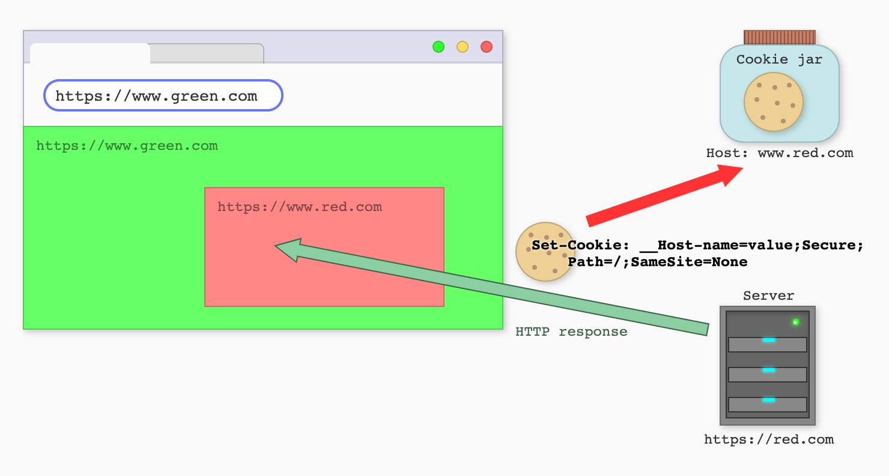
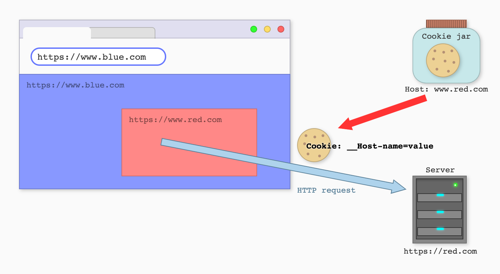
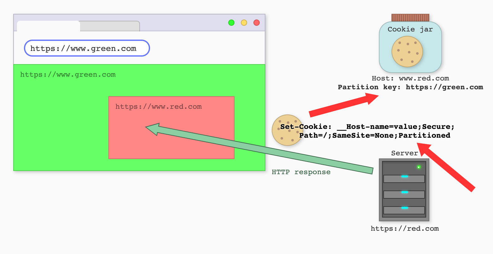
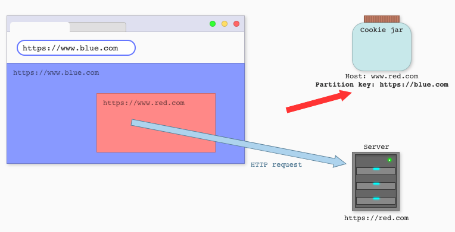
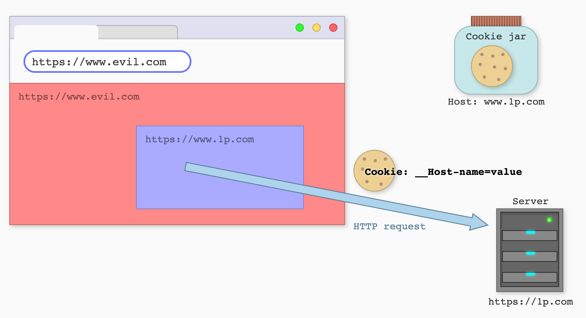
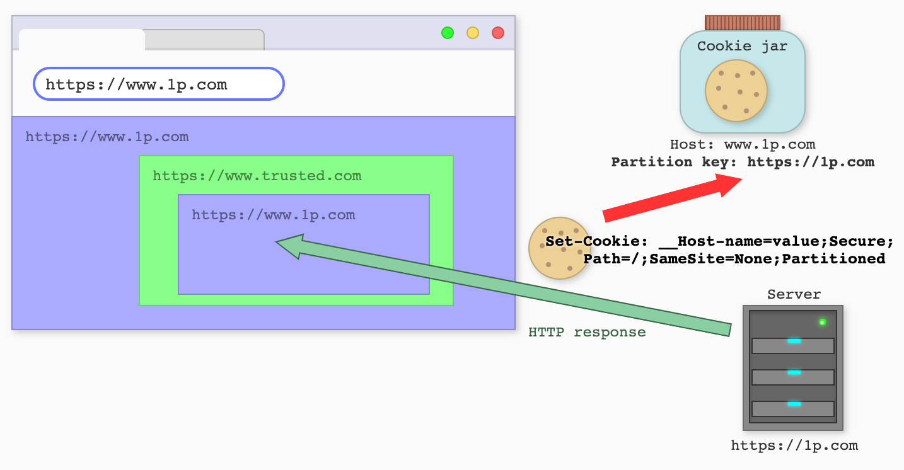
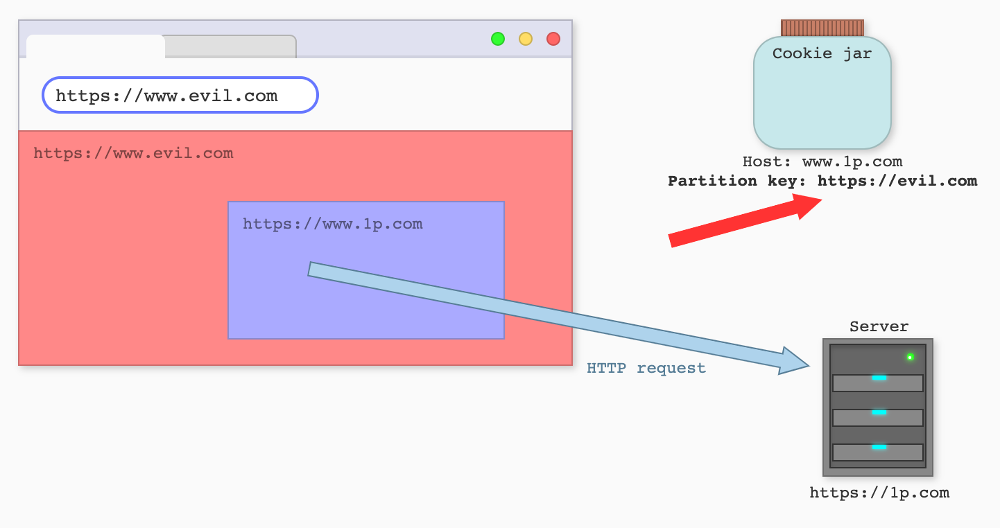

# CHIPS (Cookies Having Independent Partitioned State)

## Editors

- [Dylan Cutler](https://github.com/DCtheTall)
- [Aaron Selya](https://github.com/aselya)

## Participate

- https://github.com/privacycg/CHIPS/issues

## Table of Contents

- [Motivation](#motivation)
- [CHIPS: Opt-in Partitioned Cookies](#chips-opt-in-partitioned-cookies)
    - [Prior art](#prior-art)
        - [Partition all third-party cookies by default](#partition-all-third-party-cookies-by-default)
        - [Use Storage Access API for opt-in](#use-storage-access-api-for-opt-in)
- [Non-Goals](#non-goals)
- [Key Scenarios](#key-scenarios)
    - [Third-party store-finder service](#third-party-store-finder-service)
    - [Third-party customer service chat embed](#third-party-customer-service-chat-embed)
    - [CDN load balancing](#cdn-load-balancing)
    - [Other examples of use cases](#other-examples-of-use-cases)
- [Design Principles](#design-principles)
    - [Opt-in partitioned cookies](#opt-in-partitioned-cookies)
    - [Only sent over secure protocols](#only-sent-over-secure-protocols)
    - [Avoid a large memory footprint](#avoid-a-large-memory-footprint)
- [Detailed Design](#detailed-design)
    - [Partitioning model](#partitioning-model)
    - [Opt-in cookie attribute](#opt-in-cookie-attribute)
    - [Using `Set-Cookie` with `Partitioned`](#using-set-cookie-with-partitioned)
    - [Attaching a `Partitioned` cookie to a request](#attaching-a-partitioned-cookie-to-a-request)
    - [Example usage](#example-usage)
        - [Third-party locator service](#third-party-locator-service)
        - [Third-party customer support widgets](#third-party-customer-support-widgets)
        - [CDN load balancing](#cdn-load-balancing)
    - [How to enforce design principles](#how-to-enforce-design-principles)
        - [`Secure` attribute](#secure-attributes)
        - [`HttpOnly` attribute](#httponly-attribute)
        - [`SameSite` attribute](#samesite-attribute)
        - [Limit the number of cookies a third party can use in a single partition](#limit-the-number-of-cookies-a-third-party-can-use-in-a-single-partition)
    - [Clearing partitioned cookies](#clearing-partitioned-cookies)
    - [CookieStore API](#cookiestore-api)
    - [Storage Access API](#storage-access-api)
    - [Handling older or incompatible clients](#handling-older-or-incompatible-clients)
    - [Memory impact](#memory-impact)
    - [Service workers](#service-workers)
    - [Browser extensions](#browser-extensions)
        - [Extension pages](#extension-pages)
        - [Background contexts](#background-contexts)
    - [First-Party CHIPS](#first-party-chips)
- [Security and Privacy Considerations](#security-and-privacy-considerations)
- [Alternate Designs for CHIPS](#alternate-designs-for-chips)
    - [Limit the number of cookies in a partition](#limit-the-number-of-cookies-in-a-partition)
    - [Applying the 180 cookies-per-domain limit](#applying-the-180-cookies-per-domain-limit)
    - [DNS CNAME’ing](#dns-cnameing)
- [References and Acknowledgements](#references-and-acknowledgements)
    - [Acknowledgements](#acknowledgements)
    - [References](#references)

## Motivation

In order to increase privacy on the web, browser vendors are either planning or already shipping restrictions on cross-site tracking.
This includes [phasing out support for _third-party cookies_](https://blog.chromium.org/2020/01/building-more-private-web-path-towards.html), cookies sent in requests to sites other than the top-level document's site, since such cookies enable servers to track users' behavior across different top-level sites.

<center><figure>
    
    <br>
    
    <br>
    <em>
        Before CHIPS: A browser visits green.com which has an embedded red.com frame that sets a cookie. When the browser navigates to blue.com, the red.com frame can access the cookie set at green.com.
    </em>
    <br><br>
</figure></center>

Although third-party cookies can enable third-party sites to track user behavior across different top-level sites, there are some cookie use cases on the web today where cross-domain subresources require some notion of session or persistent state that is scoped to a user's activity on a single top-level site.
Some examples of such use cases are SaaS providers ([1](https://github.com/privacycg/first-party-sets/issues/33), [2](https://github.com/privacycg/storage-access/issues/74)), [headless CMS providers](https://gist.github.com/rexxars/42d870946d82a3daa0e35b238e0b7d7a), and sandbox domains for serving untrusted user content, e.g. `googleusercontent.com`, `githubusercontent.com` ([1](https://blog.kerika.com/googleusercontent-com-can-trip-you-up-if-you-disable-third-party-cookies/), [2](https://gadgetstouse.com/blog/2020/12/11/fix-google-drive-downloads-not-working-in-microsoft-edge/)).

## CHIPS: Opt-in Partitioned Cookies

In order to meet the use cases, we propose to introduce partitioned cookies a.k.a. CHIPS (Cookies Having Independent Partitioned State).
Third parties may opt-in to using CHIPS by setting their cross-site cookies with the `Partitioned` attribute.
This attribute will indicate to user agents that these cross-site cookies should only be available in the same top-level site that the cookie was created in.

Under this proposal when a user visits `green.com` and embedded content from `red.com` sets a cookie in response to the cross-site request, the user agent would only send that cookie when the top-level site is `green.com`.
When they are visiting a new site, `blue.com`, an embedded `red.com` frame would not receive the cookie set when `red.com` was embedded in `green.com`.

<center><figure>
    
    <br>
    
    <br>
    <em>
        After CHIPS: A browser visits green.com which has an embedded red.com frame that sets a cookie. When the user visits blue.com, the red.com frame cannot access the cookie set at green.com since it was a different top-level site.
    </em>
    <br><br>
</figure></center>

**Note:** Firefox recently introduced partitioning all third-party cookies by default as a compatibility measure in the ETP Strict mode, and Safari briefly enabled (and subsequently rolled back) this in a previous version of ITP.
More details on their approaches are discussed in [Partition all third-party cookies by default](#partition-all-third-party-cookies-by-default).

### Prior art

#### Partition all third-party cookies by default

[Firefox](https://blog.mozilla.org/security/2021/02/23/total-cookie-protection/) announced that they are partitioning all third-party cookies by default, i.e. all cross-site cookies are partitioned by top-level site without any opt-in, into their ETP Strict mode.
Safari [previously](https://webkit.org/blog/8613/intelligent-tracking-prevention-2-1/) tried partitioning cookies based on heuristics, but eventually chose to block them altogether citing developer confusion as one of the reasons.

We do not think cookies should be partitioned without a third-party opt-in since third parties built their existing servers with the expectation of an unpartitioned third-party cookie.
This can cause confusion and unexpected bugs ([1](https://bugzilla.mozilla.org/show_bug.cgi?id=1316019), [2](https://bugzilla.mozilla.org/show_bug.cgi?id=1319728), [3](https://bugzilla.mozilla.org/show_bug.cgi?id=1629062), [4](https://bugzilla.mozilla.org/show_bug.cgi?id=1651134)).

Partitioning by default also has more implementation complexity for browser developers, since they need to consider how partitioning the cookie jar will impact any part of the browser that interacts with cookies.
Supporting opt-in cookie partitioning while gradually moving the web off of globally-scoped third-party cookies will help ease the transition for browsers.

There is also the issue of state proliferation.
There are some third-party origins on the web today that are prevalent across many partitions.
If we partition the cookie jar by default and do not include a new upper bound on the size of each cookie jar partition, device storage limits will be exhausted more quickly.

#### Use Storage Access API for opt-in

At the time of writing there is a [proposal](https://github.com/privacycg/storage-access/issues/75) under discussion for opt-in partitioned cookies, but instead of using a cookie attribute users would opt-in to giving third parties a partitioned cookie jar using the Storage Access API.

## Non-goals

- This document does not describe any changes to how a top-level site interacts with its own cookies.
  For top-level site owners, most partitioned cookie use cases are covered by using SameSite=Lax/Strict instead.
  However, there are uncommon cases where CHIPS may be useful to top-level site owners.
  See [First-Party CHIPS](#first-party-chips) section below for more info.

- This document does not describe a replacement for third-party cookies that are shared across different domains owned by the same first organization. For this use case, consider using [First-Party Sets](https://github.com/privacycg/first-party-sets).

- This document also does not describe partitioning any other type of browser storage other than cookies (e.g. HTTP cache, LocalStorage, service workers, etc.).

- This document does not describe how unpartitioned cross-site cookies (i.e. third-party cookies) will be removed.
  This document describes an opt-in cross-site cookie partitioning mechanism which will be introduced before third-party cookies are removed entirely.
  The motivation being to provide developers a well-lit path forward for cross-site cookie use cases scoped to activity on a single top-level context before browsers completely remove unpartitioned third-party cookies.

## Key Scenarios

Below are some examples of third-party cookie use cases that are unrelated to tracking that we would like to support with CHIPS. We first describe how unpartitioned third-party cookies meet that particular use case and then we describe the ideal end state would be when cross-site cookies are partitioned by top-level site.

### Third-party store-finder service

#### Before unpartitioned third-party cookies are blocked

Let's say that a page on `shoes.com` wants to show users a map of their store locations, but they do not have the  resources to implement a locator service.
Instead, they contract that work out to a third-party SaaS provider, `embed.maps.com`, and `shoes.com` embeds a frame owned by `embed.maps.com` which renders a map that users can use to pick their preferred store location and look up directions.

When the browser is on `shoes.com`, an embedded frame owned by `embed.maps.com` sets a cookie to store a user's preferred store location:

```
Set-Cookie: __Host-locationid=187; SameSite=None; Secure; HttpOnly; Path=/;
```

On subsequent visits to `shoes.com`, the first request to `embed.maps.com` would include the following header:

```
Cookie: __Host-locationid=187;
```

This allows `embed.maps.com` to know the user's preferred location for `shoes.com`, which can be used for server-side rendering of their map, resulting in end users seeing a faster-loading map which remembers their preferred store location. However, this unpartitioned cookie could also include cross-site identifiers that let `embed.maps.com` track user activity across top-level sites.

#### After unpartitioned third-party cookies are blocked

Without the ability to set any cross-site cookies, one alternative that services like `embed.maps.com` have is to use other forms of browser storage (e.g. LocalStorage).
In order to detect the presence of these other types of client state, `embed.maps.com` will have to wait for a JavaScript execution context to load before they can access the user preferences: resulting in longer loading times and a worse user experience.

Our goal is for sites like `embed.maps.com` to be able to set a cookie while embedded into `shoes.com` that would only be sent when the user's browser's top-level site is `shoes.com`.
If the user navigates to another top-level site, subsequent requests to `embed.maps.com` would not include the cookie set when the top-level site was `shoes.com`.
This would enable `embed.maps.com` to store user preferences with cookies without being able to store a cross-site identifier on users' machines.

### Third-party customer service chat embed

#### Before unpartitioned third-party cookies are blocked

Consider `retail.com` has noticed that users are having trouble signing up for an account and navigating through the site's purchase flow.
The owners of `retail.com` contract a third party, `support.chat.com`, to embed a chat widget on `retail.com` to help users who need support.

When a user is interacting with `support.chat.com`'s widget, they set a session cookie to continue conversations between top-level page navigations:

```
Set-Cookie: __Host-coversationid=a3e70; SameSite=None; Secure; HttpOnly; Path=/;
```

This way when a new page on `retail.com` loads, the request to load the frame with `support.chat.com`'s will include a cookie which lets `support.chat.com` know which conversation the request belongs to:

```
Cookie: __Host-coversationid=a3e70;
```

However, this cookie also provides `support.chat.com` a cross-site identifier that they can use to track users on other sites that use `support.chat.com`.

#### After unpartitioned third-party cookies are blocked

Without the ability to set a cross-site cookie, `support.chat.com` could instead rely on `retail.com` passing along their first-party state (or some derived value of it).
However, if the users have not yet created an account and the support widget is helping them sign up, then `retail.com` would have no notion of identity to forward to `support.chat.com`.

`support.chat.com` could also use other methods of storage like LocalStorage or IndexedDB.
However, like in the example above with `embed.map.com`, these methods of storage require `support.chat.com` to wait for a JavaScript context to load to access their state.

Our goal is to provide services like `support.chat.com` the ability to set cookies when they are in a third-party context.
However, that cookie is only available when the user is browsing the same top-level site that the cookie was set in.
This allows `support.chat.com` to have a notion of session within a single top-level site without giving them a cross-site tracking mechanism.

### CDN load balancing

#### Before unpartitioned third-party cookies are blocked

Consider the site `example.com` who uses a third-party CDN, `static.cdn.com` to host some of its static assets.
`static.cdn.com`'s network uses load balancing servers which use a cookie to store the result of computing the best way to route an incoming request.

With unpartitioned third-party cookies, when a user navigates to `example.com` for the first time, `static.cdn.com` would respond to a browser's first request with the following `Set-Cookie` header:

```
Set-Cookie: __Host-lb=a3e7; SameSite=None; Secure; HttpOnly; Path=/;
```

...where the value of the cookie is some string of bits that `static.cdn.com`'s load balancers can use to direct a request.
Subsequent requests to `static.cdn.com` would include the following `Cookie` header:

```
Cookie: __Host-lb=a3e7;
```

The ability to set a cookie this way allows requests to `static.cdn.com` to have lower latency, since they do not need to compute how to route each request to the server.
This improved latency provides a better experience for users on sites that use `static.cdn.com` to serve static content.

The problem with this design is that when a user navigates to another top-level site that also uses `static.cdn.com` to serve static content, the load balancing cookie will be sent in requests to `static.cdn.com`.
It follows that `static.cdn.com` could also use this cookie to also tie together users' sessions across different top-level sites.

#### After unpartitioned third-party cookies are blocked

Without unpartitioned cookies, `static.cdn.com` could not use cookie to store load balancing information on the client side.
This means that they must either compute the best way to route a request each time a user pings their server, but this would increase latency and lead to user frustration.
`static.cdn.com` could use alternative storage mechanisms to store this information for its load balancers, but this would mean that `static.cdn.com` would need script execution in order to access this information.
This means that if `example.com` is just using `static.cdn.com` to host static assets and does not want to embed their JavaScript into their site, users would experience high latency.

Our goal is to allow third-party CDNs like `static.cdn.com` to be able to use cookies for their load balancers but have those cookies be partitioned by top-level site.
This means that if `static.cdn.com` sets a load balancing cookie on a browser on `example.com`, requests to `static.cdn.com` will not include that cookie when the browser navigates to `other.com`.

This implies that `static.cdn.com` will have to recompute the value of the load balancing cookie for each top-level site a user visits.
However, this is preferable to blocking all cookies in third-party contexts because then `static.cdn.com` will have to compute the best way to route a request each time.
A partitioned cookie is also more preferable for `static.cdn.com` than JavaScript storage since any data in storage would not be available until the document loads.

### Other examples of use cases

Some other examples of use cases for partitioned cookies not listed above are:

- Third-party CDNs that use cookies to serve access-controlled content
- Front-end frameworks that rely on remote hosting and RPCs to remote services
- Other types of third-party SaaS embeds

## Design Principles

### Opt-in partitioned cookies

The primary aspect that distinguishes this proposal from existing implementations of partitioned cookies is the third-party opt-in.
Cookies must be set with a new attribute in order to be sent on cross-party requests once (unpartitioned) third-party cookies are obsoleted.

This principle is in line with the [principle of least privilege](https://en.wikipedia.org/wiki/Principle_of_least_privilege) in the long term.
Initially, this new attribute will restrict a cookie's behavior, since it will limit the scope in which cookies can be sent compared to unpartitioned third-party cookies.
But, in the long term these cookies will be the only cookies available in cross-party contexts.

Although existing software and APIs will need to be updated to support this new cookie attribute, we believe that an opt-in will be the best way to help move the web from (unpartitioned) third-party cookies without causing unexpected bugs.
See the [Partition all third-party cookies by default](#partition-all-third-party-cookies-by-default) section below for more information.

### Only sent over secure protocols

Partitioned cookies must only be set by and sent over secure protocols.
This helps address some aspects of cookies' [weak confidentiality](https://tools.ietf.org/html/draft-ietf-httpbis-rfc6265bis-07#section-8.5) and [weak integrity](https://tools.ietf.org/html/draft-ietf-httpbis-rfc6265bis-07#section-8.6).

### Avoid a large memory footprint

One concern about introducing partitioned cookies is the proliferation of state on users' machines.
With unpartitioned third-party cookies, a single third party only needed to set one cookie on a user's machine which could be used for cross-site requests across all top-level sites a user visits.
After unpartitioned third-party cookies are removed, a third party will need to set one cookie per top-level context that the user visits, resulting in more cookies set on users' machines.

Browsers that wish to support partitioned cookies must impose additional limitations on the number of cookies available to a third-party domain per-partition.

However, it is also necessary for user agents to design these limits in a way that does not allow malicious third parties from learning cross-site information about users.
See [Limit the number of cookies in a partition](#limit-the-number-of-cookies-in-a-partition) for [Applying the 180 cookies-per-domain limit](#applying-the-180-cookies-per-domain-limit) in [Alternative Designs for CHIPS](#alternative-designs-for-chips) for more details.

## Detailed Design

### Partitioning model

Today, cookies are keyed on the hostname or domain of the site that set them, i.e. their _host key_.
After CHIPS, cookies that opt into partitioning will be double-keyed on their _partition key_ and their _host key_.
A cookie's partition key is the [site](https://html.spec.whatwg.org/#sites) (i.e. scheme and registrable domain) of the top-level URL the browser was visiting at the start of the request to the endpoint that set the cookie.

Likewise, a request's partition key is the site of the top-level URL the browser is visiting at the start of a request.
Browsers must only send a cookie with the `Partitioned` attribute in requests with the same partition key as that cookie.

### Opt-in cookie attribute

We propose a new cookie attribute, `Partitioned`, which must be specified by the `Set-Cookie` header to indicate that the cookie should only be delivered in the same partition the cookie was set in.
Any cookies that are not set with the `Partitioned` attribute will eventually be blocked in third-party contexts.

### Using `Set-Cookie` with `Partitioned`

Below is an example of a `Set-Cookie` header that uses the `Partitioned` attribute:

<pre>
Set-Cookie: __Host-SID=31d4d96e407aad42; SameSite=None; Secure; Path=/; <b>Partitioned;</b>
Set-Cookie: abc=21ef; SameSite=None; Secure // blocked in 3p contexts
</pre>

#### Algorithm

Below is the algorithm that browsers can use to parse cookie lines with this attribute.
This algorithm could be added to [section 5.3 of RFC6265bis](https://datatracker.ietf.org/doc/html/draft-ietf-httpbis-rfc6265bis-07#section-5.3).

1.  Let "partition-key" be null.

1.  If an attribute-name case-insensitively matches the string `"Partitioned"` then "partition-key" should be the [site](https://html.spec.whatwg.org/#sites) of the top-level document when the user agent made the request.

1.  Append an attribute to the cookie-attribute-list with an attribute-name of "PartitionKey" and an attribute-value of "partition-key".

Below is the algorithm for storing `Partitioned` cookies.
These steps could be added to [section 5.4 of RFC6265bis](https://datatracker.ietf.org/doc/html/draft-ietf-httpbis-rfc6265bis-07#section-5.4) after after the user agent checks for the `__Host-` prefix.

1.  If the cookie-attribute-list contains an attribute with an attribute-name of "PartitionKey" and the attribute-value is null, then skip the following steps and insert the cookie into the cookie store.

1. If the cookie-attribute-list does not contain an attribute with an attribute-name of `Secure` then abort these steps and ignore the cookie entirely.

1.  Set the cookie's partition-key to the attribute-value of the element in the attribute-list whose attribute-name is "PartitionKey".

Also, we would modify the first part of step 19 of the algorithm in step 5.4 to also include the partition-key in the list of cookie attributes to check, so that two cookies with the same name, domain, host-only-flag, and path can coexist in the cookie store if their partition-key values differ.

### Attaching a `Partitioned` cookie to a request

In third-party contexts, the `Partitioned` cookies would be sent in the request header as follows:

```
Cookie: __Host-SID=31d4d96e407aad42
```

Note: If this is a first-time request to the third-party with a different partition key, no cookies would be sent.
In other words, the third-party would get a new identifier for each top-level context.

#### Algorithm

Below is an algorithm for attaching `Partitioned` cookies to a request.
These steps could be added to the algorithm described in [section 5.5 of RFC6265bis](https://datatracker.ietf.org/doc/html/draft-ietf-httpbis-rfc6265bis-07#section-5.5) after the first step.

For each cookie in the cookie-list do the following:

1.  If the cookie's partition-key is null, skip the following parts of this step.

1.  Let "request-partition-key" be the [site](https://html.spec.whatwg.org/#sites) of the top-level document when the user agent initiated the request.

1.  If the cookie's partition-key is not an exact string match of request-partition-key, then remove that cookie from the cookie-list.

### Example usage

Below is a description of how `Partitioned` cookies can be used to meet the use cases laid out in the [Key Scenarios](#key-scenarios) section above.
For these examples, you can assume all of the resources are sent from secure origins.

#### Third-party locator service

Let us reconsider [example](#third-party-store-finder-service) of `shoes.com` and `embed.maps.com`: a locator service which wishes to use a cookie to store user preferences for their activity on `shoes.com` (e.g. their favorite store location).

After third-party cookies are removed, `embed.maps.com` could no longer set a cookie when the top-level site is not `maps.com` unless they include the `Partitioned` attribute:

<pre>
Set-Cookie: __Host-locationid=187; SameSite=None; Secure; HttpOnly; Path=/; <b>Partitioned;</b>
</pre>

Any subsequent request to `embed.maps.com` whose partition key's domain is `shoes.com` would include the following header:

```
Cookie: __Host-locationid=187;
```

However, when the browser navigates to a different site, the browser would not send the `Cookie` header above to `embed.maps.com`.
This gives `embed.maps.com` the capability to store users' favorite `shoes.com` store location, but those preferences would only be accessible to `embed.maps.com` when the top-level site is `shoes.com`.
This is to ensure that `embed.maps.com` cannot use this cookie to link users' activity across different top-level sites.

#### Third-party customer support widgets

Let us also reconsider the [example](#third-party-customer-service-chat-embed) of `retail.com` which wishes to embed a third-party customer support widget, `support.chat.com`, to help users sign up for an account on their site.
After third-party cookies are removed, `support.chat.com` can only set a cookie when the top-level site is `retail.com` if that cookie has the `Partitioned` attribute:

<pre>
Set-Cookie: __Host-coversationid=a3e70; SameSite=None; Secure; HttpOnly; Path=/; <b>Partitioned;</b>
</pre>

Any request to `support.chat.com` whose partition key's domain is `retail.com` would include the cookie:

```
Cookie: __Host-coversationid=a3e70;
```

When the user navigates to a different top-level site, any request to `support.chat.com` would have a different partition key, so the cookie above would not be available.
This means that the cookie cannot be used by `support.chat.com` to identify users across top-level sites.

#### CDN load balancing

When the user visits example.com and `static.cdn.com` wants to set a cookie storing the result of computing the best way to direct this particular user's requests. They could do so using the `Partitioned` attribute using the following Set-Cookie header:

<pre>
Set-Cookie: __Host-lb=a3e7; SameSite=None; Secure; HttpOnly; Path=/; <b>Partitioned;</b>
</pre>

This cookie would only be available to `static.cdn.com` when the browser's top-level site is `example.com`.
When the browser navigates to another top-level site, then subsequent requests to `static.cdn.com` will not include this cookie.

### How to enforce design principles

#### `Secure` attribute

User agent must reject any cookie set with `Partitioned` that does not also include the `Secure`.

#### `HttpOnly` attribute

User agents **may** also enforce that `Partitioned` cookies also include the `HttpOnly` attribute, but we are less confident they should require it.
Ensuring that partitioned cookies are only available on the network stack makes them less susceptible to XSS attacks.

#### `SameSite` attribute

User agents may only accept `Partitioned` cookies if their `SameSite` attribute is `None`.

**Note:** a `Partitioned` cookie without `SameSite=None` is effectively just a same-site cookie which cannot be sent in a third-party context anyway.

#### Limit the number of cookies a third party can use in a single partition

A third-party domain's cookie jar should have a much lower per-partition size limit than existing garbage collection thresholds ([180 cookies per domain](https://source.chromium.org/chromium/chromium/src/+/master:net/cookies/cookie_monster.h;l=104;drc=da465ccade3a693e1deac3bf01b1c83d12dbf553) in Chrome).
User agents must limit third-party domains to just one or some small number of cookies per-partition.
The number of cookies in a single partition per third-party is scoped by domain so that a third-party could not circumvent this limit by registering new subdomains.

Based on [feedback on this proposal](https://github.com/privacycg/CHIPS/issues/48) that both a lower limit of cookies per-partition as well as a lower maximum size of individual partitioned cookies will pose problems for developers, we suggest a limit based on the total amount of memory used up by cookies of a partitioned site. This limit could be 10 kibibytes.

User agents may enforce some global limit on the number of partitioned cookies in the cookie jar.
This is to ensure that as a user visits more top-level sites over time that the number of partitioned cookies saved to their machine does not grow over time without bound.

### Clearing partitioned cookies

If a third-party site sends `Clear-Site-Data`, then the user agent should clear all cookies available to that third-party in the partition for the current top-level site alone.
The user agent must not clear the third-party's cookies in other partitions.
This is to prevent abuse of such a capability as a cross-site tracking vector as [described here](https://github.com/privacycg/storage-partitioning/issues/11).

Browsers may choose to provide user controls to clear individual partitions of a site’s cookies.

Top-level sites should not be able to clear the third-parties' cookies in their partition.
This would provide a potential attack vector for top-level sites to interfere with code running in third-party frames.

### CookieStore API

We propose modest changes to the [CookieStore API](https://wicg.github.io/cookie-store/) to support `Partitioned` cookies:

1.  Add an optional boolean field, `partitioned` to [CookieInit](https://wicg.github.io/cookie-store/#dictdef-cookieinit).
    This will allow scripts to set `Partitioned` cookies using [`CookieStore.set`](https://wicg.github.io/cookie-store/#CookieStore-set).
    If the field is not present, it should be considered `false`.

1.  Add a boolean field, `partitioned`, to [CookieListItem](https://wicg.github.io/cookie-store/#dictdef-cookielistitem).
    The field will indicate if a cookie is partitioned to callers of [`CookieStore.get`](https://wicg.github.io/cookie-store/#CookieStore-get) and [`CookieStore.getAll`](https://wicg.github.io/cookie-store/#CookieStore-getAll).

1.  Add an optional boolean field, `partitioned` to [CookieStoreDeleteOptions](https://wicg.github.io/cookie-store/#dictdef-cookiestoredeleteoptions).
    This will allow callers of [`CookieStore.delete`](https://wicg.github.io/cookie-store/#CookieStore-delete) to specify whether they want to delete a `partitioned` cookie.
    If the field is not present, it will default to `false`.

### Storage Access API

Partitioned cookies should be accessible regardless of any choices the user has made via the Storage Access API in the given context. Even if the user has rejected or dismissed a prompt for storage access then partitioned cookies should still be accessible (partitioned LocalStorage will still be available in such a context, so blocking access to partitioned cookies would have no effect on user privacy).

### Handling older or incompatible clients

The new cookie attribute will be ignored on older clients that don't recognize it and fall back to default behavior.
Since these cookies are intended for third-party contexts, [clients that are incompatible with `SameSite=None`](https://www.chromium.org/updates/same-site/incompatible-clients) may reject cookies with `SameSite=None`.

Although it is not required, it is still recommended to still include the `__Host-` prefix.
Even clients that do not recognize the `Partitioned` attribute still enforce the semantics of the `__Host-` prefix.
This would ensure that cross-site cookies are hostname bound and only sent over secure channels, which is still a security win.

### Memory impact

Based on Chrome data, we estimate that 10 cookies per-partition will satisfy ~99% of existing cross-site cookie use cases on the web today.
Based on Chrome data aggregated over a 28 day period, we estimate partitioning cross-site cookies will increase the cookie jar size ~6% on average for Android Chrome users with at least 25 cookies and ~18% on average for desktop Chrome users with at least 25 cookies.

We find this trade-off between meeting cross-site cookie use cases and memory impact to be acceptable, but user agents may wish to impose additional size limits on the partitioned cookie jar such as a global limit on all partitioned cookies.

### Service workers

Service workers have access to cookies via the [CookieStore API](https://wicg.github.io/cookie-store/) or when they send HTTP requests using `fetch` (imagine a worker pings an HTTP endpoint that just echoes back the request's `Cookie` header in its response).
Unless service workers are partitioned, then the unpartitioned cookie jar would be available to the worker even if the cookies are `HttpOnly`.
Because of these reasons, partitioning service workers is the only way to guarantee a partitioned cookie jar.

If a user agent implements service worker partitioning, and a service worker is registered in a third-party context, then `Partitioned` cookies *must* only be surfaced to workers if the cookies' partition key matches the top-level site the worker was registered in.
The worker *must* not have access to cookies whose partition key is the worker's origin, since this would effectively give partitioned workers access to unpartitioned cross-site cookies.

Safari [has already partitioned service workers](https://webkit.org/blog/8090/workers-at-your-service/) by the top-level origin when the worker was registered and the service worker's origin, so that service workers can only interact with windows that are the same top-level origin as the top-level page when the worker was installed.
If a user agent partitions service workers using this scheme, there is no cross-site tracking risk to exposing `Partitioned` cookies to service workers.

[Service workers are disabled](https://developer.mozilla.org/en-US/docs/Mozilla/Firefox/Privacy/State_Partitioning) in Firefox when Dynamic Partitioning is enabled, but they are [working on implementing a partitioned service worker solution](https://bugzilla.mozilla.org/show_bug.cgi?id=1495241).

Service workers are listed as a type of storage that should be partitioned in the [PrivacyCG's Client-Side Storage Partitioning](https://github.com/privacycg/storage-partitioning) proposal.
Their partitioning model was described in greater detail in [this explainer](https://github.com/wanderview/quota-storage-partitioning/blob/main/explainer.md#serviceworker-api).

### Browser extensions

#### Extension pages

When extension pages load subresources from other sites, the partition key used to determine which `Partitioned` cookies should be included in requests must be the site of the topmost-level frame which is *not* an extension URL if the extension has host permissions for that frame, otherwise the partition key should be the extension URL.
If a subresource request is from the extension page's top-level frame, then the partition key is the site of the subresource URL if the extension has host permissions for that site, otherwise it should be the extension URL.

#### Background contexts

Extensions in some browsers are capable of reading cookies (for sites they have host permission) in background contexts using a JavaScript API (e.g. [Chrome](https://developer.chrome.com/docs/extensions/reference/cookies/), [Firefox](https://developer.mozilla.org/en-US/docs/Mozilla/Add-ons/WebExtensions/API/cookies)).
We propose to give extensions the ability to select which partition key to use when loading cookies by supplying a `partitionKey` string parameter that would let extensions specify which partition to load their sites' `Partitioned` cookies from and in which partition they can save cookies for their site.

It is worth noting that by allowing extension background contexts to load cookies across different partitions allows extensions to use partitioned cookies to store cross-site identifiers.
This problem is discussed further in [Security and Privacy Considerations](#security-and-privacy-considerations).

### First-Party CHIPS

Typically, top-level site owners (i.e. the "first party") would want to use `SameSite=Lax/Strict` cookies on their own site, since these cookies offer [CSRF protections](https://datatracker.ietf.org/doc/html/draft-ietf-httpbis-rfc6265bis-09#section-8.8).

However, consider a first party wishes to set a cookie in a response to a request to the top-level site that is embedded in a third-party iframe.
Since [site for cookies](https://datatracker.ietf.org/doc/draft-ietf-httpbis-rfc6265bis/#section-5.2) depends on the entire ancestor chain, the first party cannot use `SameSite=Lax/Strict` cookies.
So the first party is forced to set a `SameSite=None` cookie.

<center><figure>
    
    <br><br>
</figure></center>

However, this cookie does not have SameSite protections.
A malicious site could embed the top-level site and would have access to these cookies.

<center><figure>
    
    <br><br>
</figure></center>

After CHIPS, the first party can set `SameSite=None;Partitioned` cookies in the response from the embedded third-party frame.
The first party's embedded request will still have access to these cookies on this top-level site because the cookie partition key only considers the top-level site.

<center><figure>
    
    <br><br>
</figure></center>

Unlike `SameSite=None` cookies before CHIPS, these `Partitioned` cookies are only available on a single top-level site.
If a malicious site tries to embed the first party on their own site, then the malicious actor will not be able to see a `SameSite=None;Partitioned` cookie.

<center><figure>
    
    <br><br>
</figure></center>

## Security and Privacy Considerations

This proposal takes the opportunity of defining the semantics of a new cookie attribute in order to require the `Secure` attribute, restricting this feature to [secure contexts](https://w3c.github.io/webappsec-secure-contexts).

Sites are more prone to XSS attacks as embedded frames since these contexts rely on cross-site cookies for a notion of user session/state.
Partitioning cross-site cookies makes XSS attacks less powerful, since an attacker would need to navigate the user's browser to a compromised cookie's top-level site in order for the browser to send the cookie at all.

Partitioning cross-site cookies inevitably will lead to more state proliferation on user's machines, so there is a possible DoS risk from partitioning cross-site cookies where a malicious embedded site could set many cookies across different partitions to take up memory on clients' machines.
See [Limit the number of cookies a third party can use in a single partition](#limit-the-number-of-cookies-a-third-party-can-use-in-a-single-partition) for more information on how this proposal addresses this concern.

Cross-site cookies with the `Partitioned` attribute are less susceptible to CSRF attacks than unpartitioned, third-party cookies.
This is because a `Partitioned` cookie is only sent in requests when the browser is visiting the top-level site the cookie was created in, so a malicious top-level site will not be able to forge a request with an existing `Partitioned` cookie (unless they have compromised the top-level site that the cookie was sent from).

The proposal suggests an alternate design for cross-site cookies which does not introduce a vector for cross-site tracking.
This is a step towards making a larger privacy improvement for the web: removing third-party cookies.

One important privacy consideration is that partitioned cookies must not be subject to the 180 per-domain cookie limit, otherwise they risk introducing a side channel for cross-site tracking described in [Applying the 180 cookies-per-domain limit](#applying-the-180-cookies-per-domain-limit).

Another privacy consideration is that the privacy guarantees of partitioned cookies can be circumvented by browser extensions with host permissions.
Extensions' background contexts can query and store cookies across partitions, meaning they could store a cross-site identifier across partitions.
Unfortunately, this type of attack is unavoidable due to the nature of extensions.
Even if we block partitioned cookies (or even all cookies) from extensions' background contexts, an extension could still use content scripts to write cross-site identifiers to the DOM which the site's own script could copy to the site's partitioned cookie jar.

## Alternate Designs for CHIPS

### Limit the number of cookies in a partition

One additional limitation user agents may also enforce is to limit the number of cookies in a partition across all third-party domains as well.
This limit would prevent a single partition from taking up too much space in the cookie jar.

We chose not to enforce a global per-partition limit is that it would open a side channel for a third party to learn if another, distinct third party set a cookie within the same top-level context.

For example, say each third-party domain is restricted to 1 cookie per partition and the global per-partition limit was 10.
A malicious third party could embed frames from several domains, `evil[1-10].com` on some top-level site, `1p.com`, which sets a partitioned cookie.
If any other third party sets a partitioned cookie on `1p.com`, then one of the `evil[1-10].com` cookies will be evicted and the malicious third party will learn that another, distinct host set a cookie.
A malicious third party could use this information to determine if a user has logged in or if they may be using a locator service hosted by a distinct party.

Another attack is where `evil.com` communicates with other third parties by setting cookies only based on a user’s personal attributes or preferences.

One way to potentially circumvent this is to make the global per-partition limit much larger than the per-partition limit for each third-party domain, but it is unclear what the relative size of the global per-partition limit would have to be to mitigate these attacks.

### Applying the 180 cookies-per-domain limit

One way to avoid creating a large memory footprint may be to enforce the existing cookie limits (180 per domain in Chrome) across all cookies scoped to that domain, including `Partitioned` cookies across all partitions.
However, this may create an inadvertent side-channel that can be used by malicious third parties to learn information about users across different top-level partitions.

Consider if `evil.com` was embedded on a site, `1p.com`, and it sets 180 cookies on the users' machines when they visit `1p.com`.
On other top-level sites, `evil.com` sets another cookie which evicts one of the cookies `evil.com` set in `1p.com`'s partition.
When a user returns to `1p.com`, `evil.com` can look at how many cookies were evicted from its partition on `1p.com` to see if the user visited another site with `evil.com`.

This attack can happen even if user agents additionally enforce limits on the number of cookies that a third party can have per-partition.
Imagine `evil.com` has embedded content on many top-level sites.
On each site, they set `N` cookies, the maximum `evil.com` is allowed to set per-partition.
Once the user has visited `180/N` sites with an `evil.com` embed, once they visit another site with `evil.com`, the global limit will be exceeded and other `evil.com` cookies in other partitions would be evicted.
When the user returns to a site with an `evil.com` embed, `evil.com` will detect that cookies have been evicted.

How much entropy `evil.com` can learn about a particular user from this type of attack has not been explored.
Therefore it is not clear what the relative global and per-partition limits would need to be to prevent `evil.com` from learning any identifiable information about users this way.

### DNS CNAME’ing

Websites can choose to delegate/alias a subdomain to a third-party service provider using DNS CNAME records.
For example, a site `myblog.example` may have a subdomain `foo.myblog.example` that can be mapped to a third-party endpoint dedicated to servicing that site at `myblog.cms.example`.
In this case, the browser treats `foo.myblog.example` as first-party with the top-level site, and any cookies sent on the request that eventually gets sent to `myblog.cms.example` are implicitly partitioned on `[foo.]myblog.example`.

It follows that any cookies sent to `foo.myblog.example` would not be subjected to cross-site cookie restrictions and would still be sent to `myblog.cms.example`.

However, this pattern has a couple of security drawbacks:

- `myblog.cms.example` would need to acquire and serve TLS certificates issued for `foo.myblog.example`.

- All `Domain` cookies set on `myblog.example` get sent to `myblog.cms.example`, including potentially sensitive data set by other subdomains on `myblog.example`.

Additionally, this adds implementation and deployment complexity for developers.

## References and Acknowledgements

### Acknowledgements

We'd like to thank Kaustubha Govind for their contributions as editor emeritus. We’d like to thank Lily Chen, Steven Bingler, Rowan Merewood, and Jeffrey Yasskin for their insights and advice that helped us shape this proposal.

### References

- [Chromium Blog: Building a more private web: A path towards making third party cookies obsolete](https://blog.chromium.org/2020/01/building-more-private-web-path-towards.html)
- [Clear-Site-Data for partitioned storage can be used for cross-site tracking · Issue #11 · privacycg/storage-partitioning](https://github.com/privacycg/storage-partitioning/issues/11)
- [Cookie Store API Explainer | cookie-store](https://wicg.github.io/cookie-store/explainer.html)
- [cookie_monster.h - Chromium Code Search](https://source.chromium.org/chromium/chromium/src/+/master:net/cookies/cookie_monster.h;l=104;drc=da465ccade3a693e1deac3bf01b1c83d12dbf553)
- [draft-ietf-httpbis-rfc6265bis-07 - Cookies: HTTP State Management Mechanism](https://tools.ietf.org/html/draft-ietf-httpbis-rfc6265bis-07)
- [[Dynamic FPI] The user and password for Facebook did not transfer to messenger.com](https://bugzilla.mozilla.org/show_bug.cgi?id=1629062)
- [Firefox 86 Introduces Total Cookie Protection - Mozilla Security Blog](https://blog.mozilla.org/security/2021/02/23/total-cookie-protection/)
- [[FirstPartyIsolation] Failed to sign in to the pixnet.net](https://bugzilla.mozilla.org/show_bug.cgi?id=1316019)
- [Fx with FPI feature wrongly displays that sign-in on youtube has failed even though it did not](https://bugzilla.mozilla.org/show_bug.cgi?id=1319728)
- [Googleusercontent.com can trip you up, if you disable third-party cookies · Kerika](https://blog.kerika.com/googleusercontent-com-can-trip-you-up-if-you-disable-third-party-cookies/)
- [Headless CMS Github Gist · LOGIN-issues.md](https://gist.github.com/rexxars/42d870946d82a3daa0e35b238e0b7d7a)
- [Headless content management system - Wikipedia](https://en.wikipedia.org/wiki/Headless_content_management_system)
- [HTML Standard](https://html.spec.whatwg.org/)
- [Intelligent Tracking Prevention 2.1 | WebKit](https://webkit.org/blog/8613/intelligent-tracking-prevention-2-1/)
- [Isolate service workers and DOM cache by first party domain](https://bugzilla.mozilla.org/show_bug.cgi?id=1495241)
- [Let embedees optionally request access to partitioned cookies and storage · Issue #75 · privacycg/storage-access](https://github.com/privacycg/storage-access/issues/75)
- [michaelkleber/privacy-model: A Potential Privacy Model for the Web: Sharding Web Identity](https://github.com/michaelkleber/privacy-model)
- [mikewest/http-state-tokens: Incrementally better HTTP state management.](https://github.com/mikewest/http-state-tokens)
- [Principle of least privilege - Wikipedia](https://en.wikipedia.org/wiki/Principle_of_least_privilege)
- [privacycg/first-party-sets](https://github.com/privacycg/first-party-sets)
- [privacycg/storage-partitioning: Client-Side Storage Partitioning](https://github.com/privacycg/storage-partitioning)
- [quota-storage-partitioning/explainer.md at main · wanderview/quota-storage-partitioning](https://github.com/wanderview/quota-storage-partitioning/blob/main/explainer.md)
- [SameSite=None: Known Incompatible Clients - The Chromium Projects](https://www.chromium.org/updates/same-site/incompatible-clients)
- [sbingler/Origin-Bound-Cookies](https://github.com/sbingler/Origin-Bound-Cookies)
- [Secure Contexts](https://w3c.github.io/webappsec-secure-contexts)
- [Software as a service use case for FPS · Issue #33 · privacycg/first-party-sets](https://github.com/privacycg/first-party-sets/issues/33)
- [State Partitioning - Mozilla | MDN](https://developer.mozilla.org/en-US/docs/Mozilla/Firefox/Privacy/State_Partitioning)
- [View Source shows source code of login page instead of current webpage on local django server](https://bugzilla.mozilla.org/show_bug.cgi?id=1651134)
- [Workers at Your Service | WebKit](https://webkit.org/blog/8090/workers-at-your-service/)
- [[Working] Fix Google Drive Downloads Not Working in Microsoft Edge – Gadgets To Use](https://gadgetstouse.com/blog/2020/12/11/fix-google-drive-downloads-not-working-in-microsoft-edge/)
